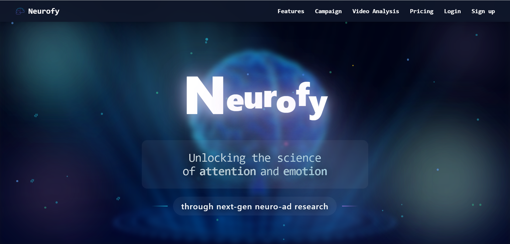
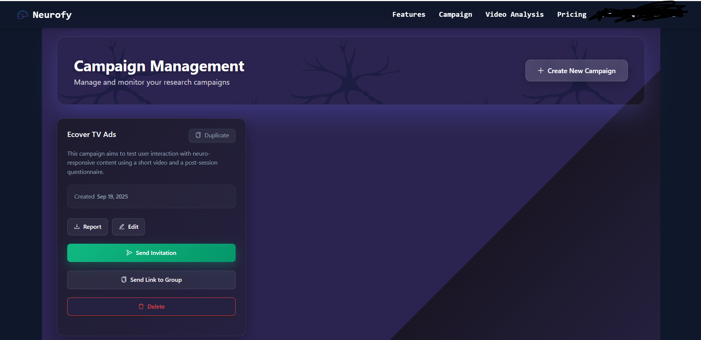
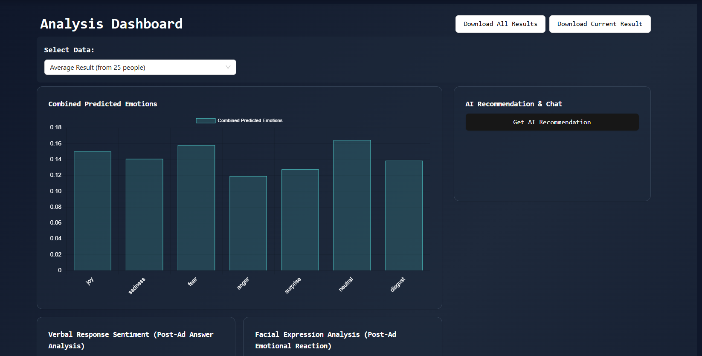
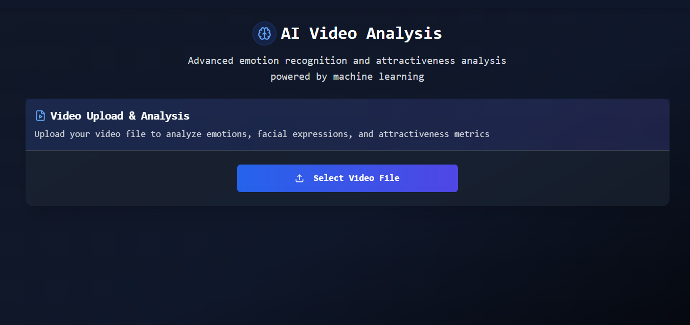

# Neurofy - AI-Powered Emotional Analysis Platform

<div align="center">


**Transform Your Ads with AI-Powered Emotional Insights**

[](https://www.neurofy.com.au)
[](LICENSE)
[](https://www.neurofy.com.au)

</div>

## 🌟 Overview

Neurofy is an advanced neuromarketing platform that uses cutting-edge AI to analyze emotional responses to advertisements through multimodal analysis. By combining facial expression recognition, sentiment analysis, and audio tone detection, Neurofy provides actionable insights to optimize ad performance and maximize ROI.

**Live Demo**: [www.neurofy.com.au](https://www.neurofy.com.au)

## 🎯 Problem Statement

Traditional qualitative research methods such as focus groups:
  - Rely on small sample sizes
  - Capture self-reported, post-hoc feedback
  - Require significant time and operational cost
As video-based advertising continues to scale across digital platforms, brands need a way to measure emotional response objectively, consistently, and at scale.

## 💡 Solution

Neurofy applies AI-driven emotional analysis to video content, enabling brands to:
  - Measure emotional engagement across key moments in a video
  - Compare creative variations before campaign launch
  - Understand audience reactions without organizing in-person research sessions
The platform is built for speed, scalability, and repeatable analysis.

## ✨ Key Features

### 🎭 Multimodal Emotion Analysis
- **Facial Expression Detection**: Frame-by-frame analysis using Vision Transformer (ViT) models
- **Sentiment Analysis**: NLP-powered text analysis from transcribed speech
- **Audio Tone Analysis**: Deep learning models for emotion recognition from audio features
- **Combined Insights**: Weighted fusion of all three modalities for comprehensive analysis

### 📊 Campaign Management
- Create and manage ad testing campaigns
- Invite participants via email
- Real-time response collection
- Comprehensive analytics dashboard

### 🚀 Advanced Video Analysis
- Upload videos for direct analysis
- Frame-by-frame emotion tracking
- Attractiveness scoring
- CSV export capabilities

### 💼 Subscription Plans
- **Starter**: Free tier with basic features
- **Basic**: $5/project for small businesses
- **Pro**: $25/project for agencies
- **Premium**: $50/project for enterprise

## 🏗️ Architecture

Neurofy follows a modern microservices architecture:

```
┌─────────────────┐
│   Next.js App   │  (Frontend - React/TypeScript)
│  www.neurofy    │
└────────┬────────┘
         │
         ├─────────────────┬─────────────────┐
         │                 │                 │
┌────────▼────────┐ ┌──────▼──────┐ ┌───────▼──────┐
│  FastAPI Backend│ │  Firebase   │ │   AWS S3     │
│  (Python/AI)    │ │  Firestore  │ │   Storage    │
└─────────────────┘ └─────────────┘ └──────────────┘
```

For detailed architecture documentation, see [ARCHITECTURE.md](ARCHITECTURE.md)

## 🛠️ Technology Stack

### Frontend
- **Framework**: Next.js 14 (React 18)
- **Language**: TypeScript
- **Styling**: Tailwind CSS
- **UI Components**: shadcn/ui, Radix UI
- **Animations**: Framer Motion
- **State Management**: React Hooks

### Backend
- **Framework**: FastAPI (Python)
- **AI/ML**: 
  - CNN-based computer vision models for facial emotion analysis
  - Transformer-based NLP models for sentiment and semantic analysis
  - Deep learning models for audio-based emotion recognition
  - Automated speech transcription for text-based analysis
 This system required cross-domain expertise in computer vision, natural language processing, audio analysis, and applied machine learning.


### Infrastructure
- **Database**: Firebase Firestore
- **Authentication**: Firebase Auth
- **Storage**: AWS S3
- **Email**: AWS SES / SendGrid
- **Deployment**: Vercel (Frontend), GCP (Backend)

For complete technology details, see [TECH_STACK.md](TECH_STACK.md)

## 📸 Screenshots

<div align="center">

### Landing Page


### Campaign Dashboard


### Analysis Results


### Video Analysis


</div>

More screenshots available in the [screenshots](screenshots/) directory.

## 🎯 Use Cases

- **Ad Agencies**: Test multiple ad versions before launch
- **Brands**: Optimize ad creative based on emotional responses
- **Content Creators**: Understand audience engagement
- **Researchers**: Conduct neuromarketing studies
- **Enterprises**: Large-scale ad testing campaigns

## 📈 Key Metrics

Neurofy analyzes 7 core emotions:
- 😠 Anger
- 🤢 Disgust
- 😨 Fear
- 😊 Joy
- 😐 Neutral
- 😢 Sadness
- 😲 Surprise

## 🔒 Security & Privacy

- All video data is securely stored in AWS S3
- Firebase Authentication for user management
- Encrypted data transmission (HTTPS)
- GDPR-compliant data handling
- Participant data anonymization

## 🌐 Live Platform

**Production URL**: [https://www.neurofy.com.au](https://www.neurofy.com.au)

## 📄 License

This project is proprietary software owned by **Austral Science**. All rights reserved.

See [LICENSE](LICENSE) for more information.

## 👥 About Austral Science

Neurofy is developed and maintained by **Austral Science**, a leading provider of neuromarketing solutions.

## 📞 Contact

For inquiries, partnerships, or support:
- **Website**: [www.neurofy.com.au](https://www.neurofy.com.au)
- **Email**: Contact through website

## 🙏 Acknowledgments

- Built with cutting-edge AI/ML technologies
- Powered by 10+ years of neuromarketing research
- Uses state-of-the-art computer vision and NLP models

---

<div align="center">

**Made with ❤️ by Austral Science**

[Website](https://www.neurofy.com.au) • [Documentation](ARCHITECTURE.md) • [Features](FEATURES.md)

</div>
